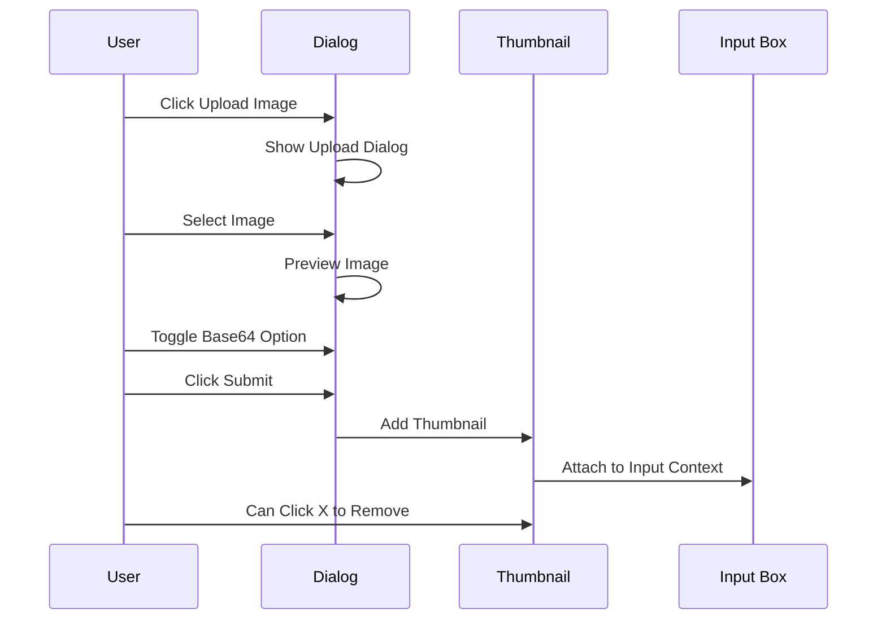
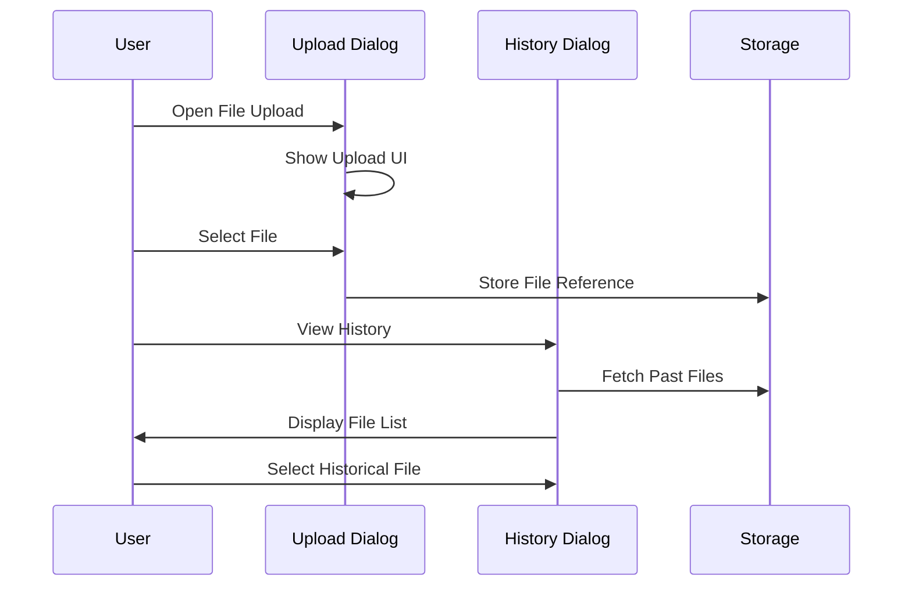
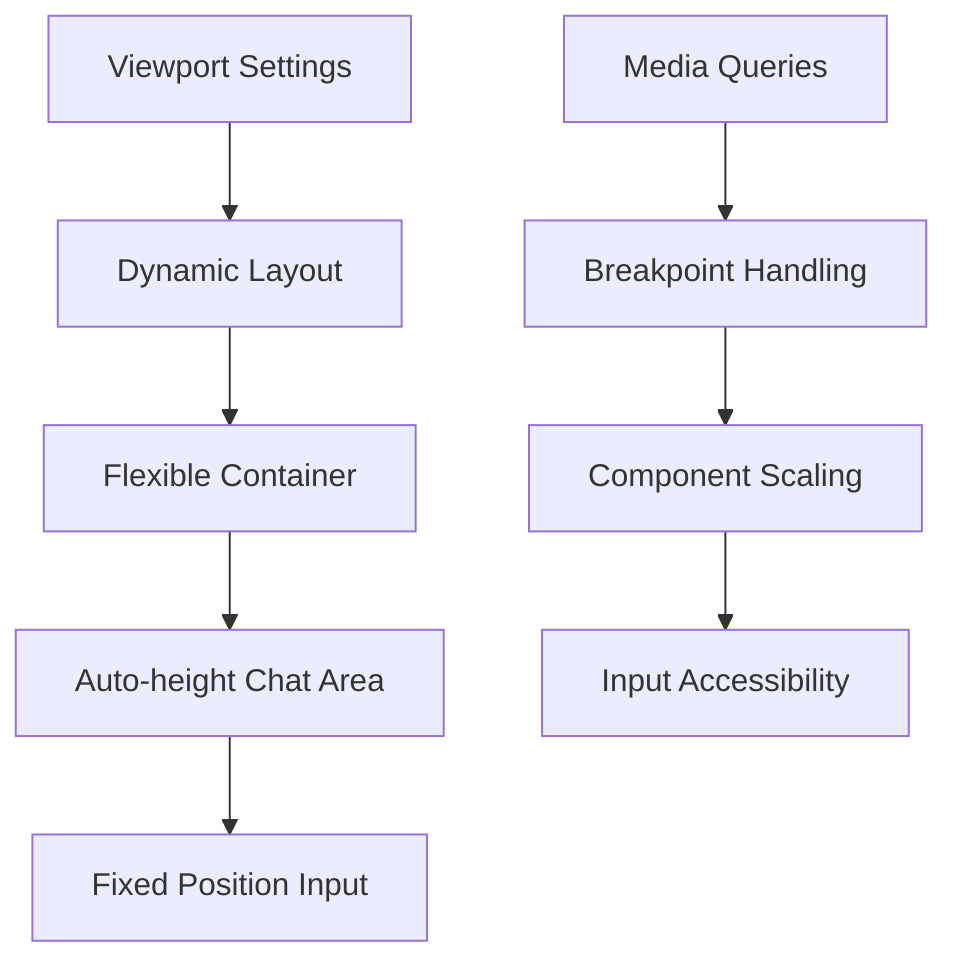
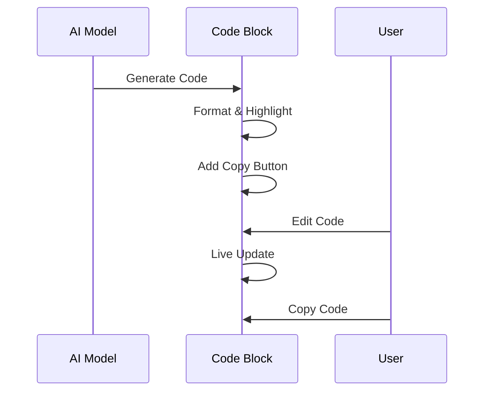

# Implementation Plan

## Overview

This document outlines the implementation plan for new features in the AI chat application, including image upload, file upload, mobile responsiveness improvements, UI enhancements, code block features, and speech-to-text integration.

## Feature Implementation Details

### 1. Image Upload Feature

#### Components

- `ImageUploadDialog`: Pop-up dialog for image upload
- `ImageThumbnail`: Displays uploaded image preview in chat input
- Base64 conversion toggle switch
- Remove (X) button for thumbnails

#### Flow



### 2. File Upload System

#### Components

- `FileUploadDialog`: Main upload interface
- `FileHistoryDialog`: Shows previously uploaded files
- File storage and retrieval system

#### Flow



### 3. Mobile Responsiveness

#### Improvements

- Dynamic viewport sizing
- Flexible container layouts
- Fixed input positioning
- Responsive component scaling

#### Layout Structure



### 4. Code Block Enhancement

#### Features

- Syntax highlighting
- Copy button
- Live editing capability
- Streaming code updates

#### Flow



### 5. UI Improvements

- Larger model selection text
- Enhanced header styling
- Improved responsive design

### 6. Speech to Text Integration

- Real-time dictation to input box
- Visual feedback during recording
- Error handling
- Status indicators

## File Structure

``` md
src/
  components/
    dialogs/
      ImageUploadDialog.tsx
      FileUploadDialog.tsx
      FileHistoryDialog.tsx
    CodeBlock.tsx
    ImageThumbnail.tsx
    FileAttachment.tsx
  hooks/
    useImageUpload.ts
    useFileHistory.ts
    useSpeechToText.ts
  styles/
    responsive.css
    codeBlock.css
  utils/
    imageProcessing.ts
    fileStorage.ts
```

## Implementation Priority

1. Mobile responsiveness and UI improvements
2. Code block features
3. Image upload functionality
4. File upload system
5. Speech to text integration

## Next Steps

1. Begin with mobile responsiveness fixes
2. Implement UI improvements
3. Develop new components iteratively
4. Add new functionality
5. Test and refine each feature